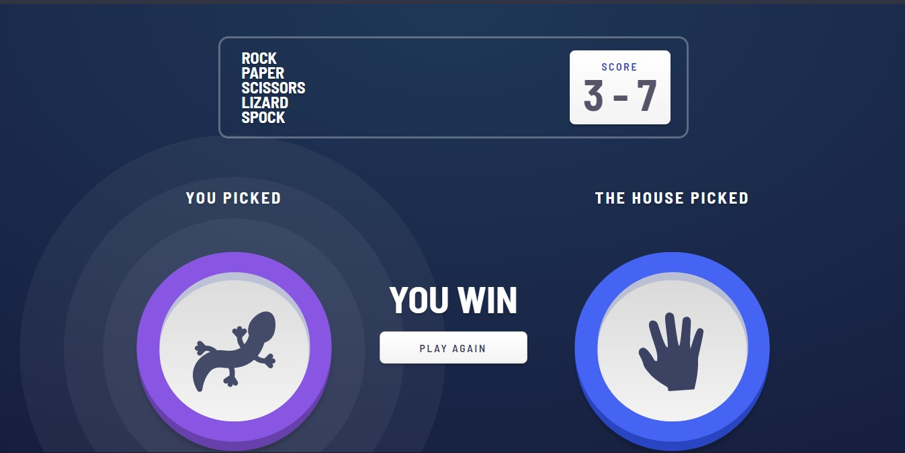

# Rock-Paper-Scissors-Lizard-Spock  

## Table of contents  

  - [General info](#general-info)
  - [Screenshots](#screenshots)
  - [Technologies](#technologies)
  - [Setup](#setup)
  - [Features](#features)
  - [Status](#status)
  - [Contact](#contact)

## General info  

A challenge on [frontendmentor](https://www.frontendmentor.io/challenges/rock-paper-scissors-game-pTgwgvgH), this project is a rock paper scissors lizard spock game that allows the users play against the computer and have their scores stored in their browser's local storage.

## Screenshots  

## Technologies  

- ReactJS - version 17.0.2
- TypeScript - version 4.0.3
- Node Sass - version 5.0.0
- HookState - version 3.0.6

## Setup  

Visit [rock-paper-scissors-lizard-spock](https://rpsls-v1.netlify.app/) in your browser.

## Features  

- Play Rock, Paper, Scissors, Lizard, Spock against the computer
- Maintain the state of the score after refreshing the browser

## Status  

Project is: _finished_

## Contact  

Created by [@funmilolajire](mailto:funmilolajire@gmail.com) - feel free to contact me!  
